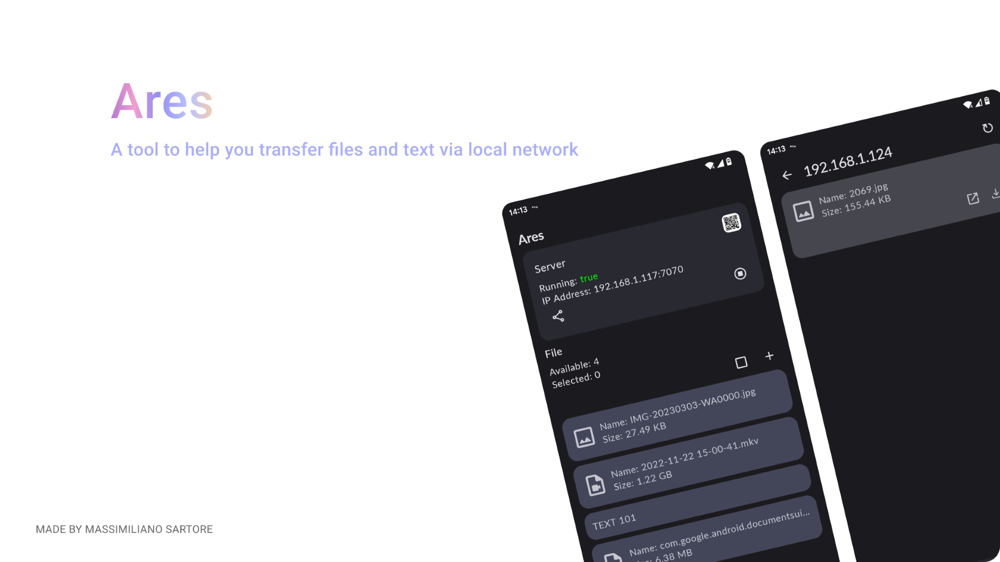

# Ares



[](https://www.codefactor.io/repository/github/msartore/ares)  

## 💡 Introduction
A tool to help you transfer files via local network 

## 🌟 Features

- Transfer files via local network
- Easy client access via App or Browser
- Local server on your device
- Scan for other servers
- Scan QR code with Ares or a QR scanner to easy access the server
- Easy file upload to server from browser

## License

Ares is released under the [GNU General Public License v3.0](LICENSE.md).

```
Copyright (C) 2023 Massimiliano Sartore

This program is free software: you can redistribute it and/or modify
it under the terms of the GNU General Public License as published by
the Free Software Foundation, either version 3 of the License, or
(at your option) any later version.

This program is distributed in the hope that it will be useful,
but WITHOUT ANY WARRANTY; without even the implied warranty of
MERCHANTABILITY or FITNESS FOR A PARTICULAR PURPOSE.  See the
GNU General Public License for more details.

You should have received a copy of the GNU General Public License
along with this program.  If not, see <http://www.gnu.org/licenses/>.
```
